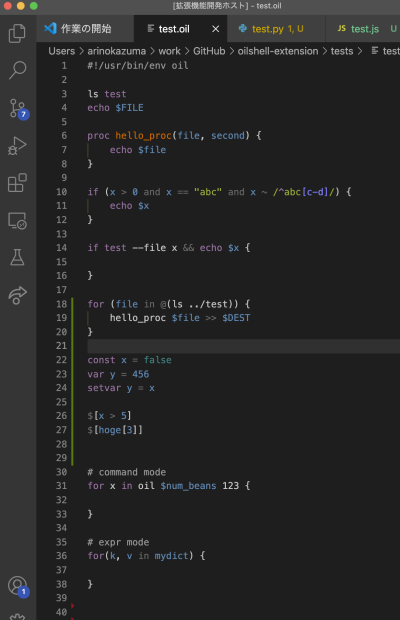

# oilshell-extension README

This is a VS Code extension for [Oil](http://www.oilshell.org/) shell script.

## Features

- Basic colorring support

## For contributor

If you want to add grammar, please also add example of that script in tests/test.ooil.

