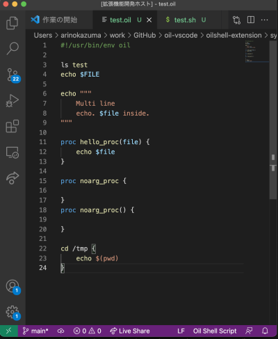

# oilshell-extension README

This is a VS Code extension for [Oil](http://www.oilshell.org/) shell script.

Currently, almost the same as shell script mode of VSCode built-in.

## Features

- `"""` matching
- proc support

## TODO

- @(), $() support
- const, var setvar support
- regexp support

